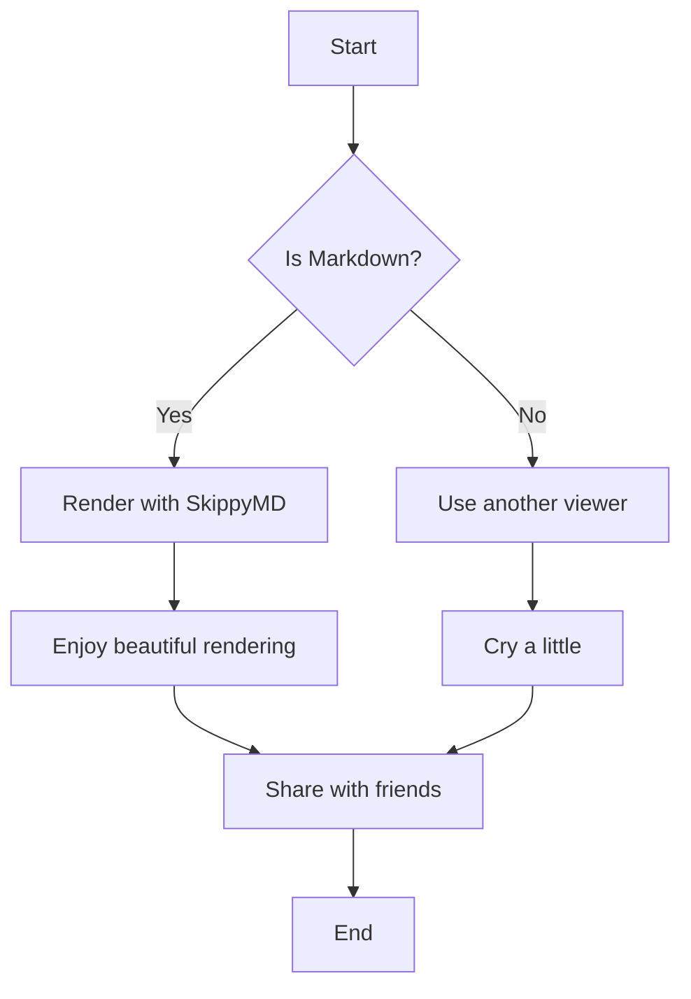
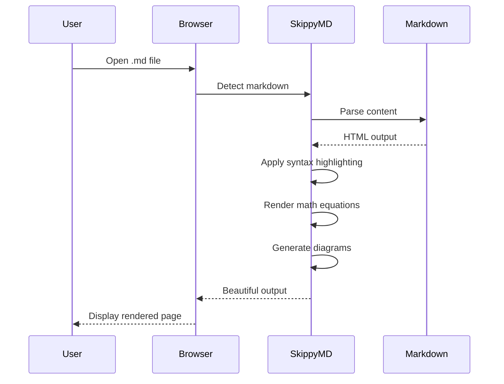
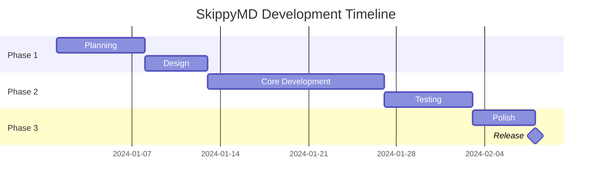
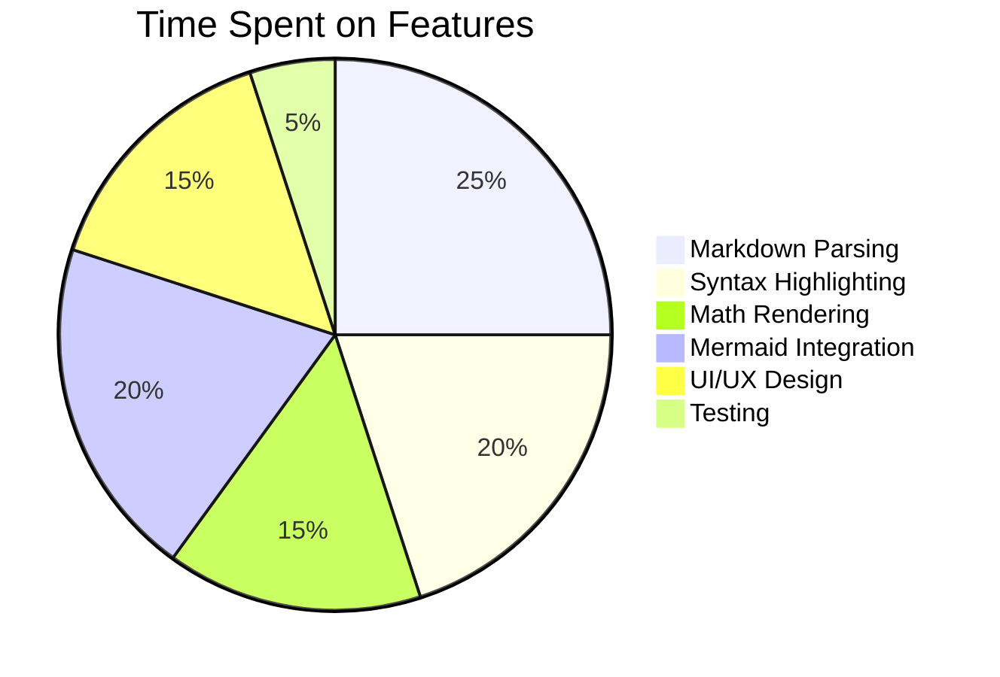
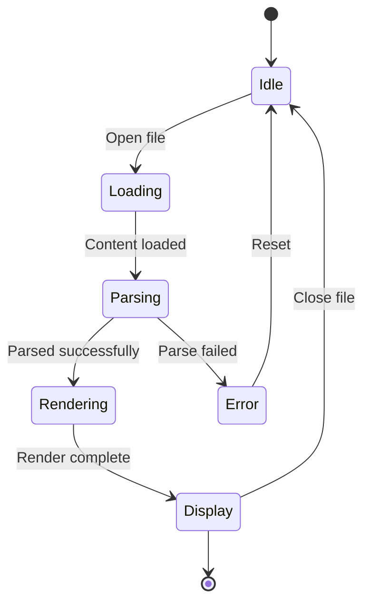

# SkippyMD Test Document 🥫

Welcome to the **SkippyMD** comprehensive test document! This file exercises all features.

## Table of Contents

This document will automatically generate a table of contents in the sidebar.

## Text Formatting

This is regular text. You can use **bold**, *italic*, ***bold italic***, ~~strikethrough~~, and `inline code`.

> This is a blockquote.
> It can span multiple lines.
> 
> Even multiple paragraphs!

### Lists

Unordered list:
- Item 1
- Item 2
  - Nested item 2.1
  - Nested item 2.2
- Item 3

Ordered list:
1. First item
2. Second item
3. Third item
   1. Nested 3.1
   2. Nested 3.2

### Task Lists

- [x] Feature 1: Markdown rendering
- [x] Feature 2: Syntax highlighting
- [x] Feature 3: Math equations
- [x] Feature 4: Mermaid diagrams
- [ ] Feature 5: World domination

## Links and Images

[Visit GitHub](https://github.com)

Auto-linked URL: https://example.com


## Code Blocks

### JavaScript

```javascript
function fibonacci(n) {
    if (n <= 1) return n;
    return fibonacci(n - 1) + fibonacci(n - 2);
}

console.log(fibonacci(10)); // Output: 55
```

### Python

```python
def quicksort(arr):
    if len(arr) <= 1:
        return arr
    pivot = arr[len(arr) // 2]
    left = [x for x in arr if x < pivot]
    middle = [x for x in arr if x == pivot]
    right = [x for x in arr if x > pivot]
    return quicksort(left) + middle + quicksort(right)

print(quicksort([3, 6, 8, 10, 1, 2, 1]))
```

### Bash

```bash
#!/bin/bash
for i in {1..5}; do
    echo "Iteration $i"
done
```

### JSON

```json
{
  "name": "SkippyMD",
  "version": "1.0.0",
  "features": ["markdown", "math", "diagrams"],
  "awesome": true
}
```

## Tables

| Feature | Status | Priority |
|---------|--------|----------|
| Markdown rendering | ✅ Done | High |
| Syntax highlighting | ✅ Done | High |
| Math equations | ✅ Done | Medium |
| Mermaid diagrams | ✅ Done | Medium |
| Dark/Light theme | ✅ Done | Low |

## Math Equations

### Inline Math

The famous equation: $E = mc^2$

Pythagorean theorem: $a^2 + b^2 = c^2$

### Block Math

The quadratic formula:

$$
x = \frac{-b \pm \sqrt{b^2 - 4ac}}{2a}
$$

Euler's identity:

$$
e^{i\pi} + 1 = 0
$$

The sum of a geometric series:

$$
S = \sum_{n=0}^{\infty} ar^n = \frac{a}{1-r} \quad \text{for } |r| < 1
$$

Matrix multiplication:

$$
\begin{bmatrix}
a & b \\
c & d
\end{bmatrix}
\;
\begin{bmatrix}
x \\
y
\end{bmatrix}
\;=\;
\begin{bmatrix}
ax + by \\
cx + dy
\end{bmatrix}
$$

## Mermaid Diagrams

### Flowchart



### Sequence Diagram



### Gantt Chart



### Pie Chart



### State Diagram



## Emoji Support

Emojis work great! :rocket: :sparkles: :brain: :books: :computer:

:tada: :fire: :zap: :star: :heart: :thumbsup: :100:

## Horizontal Rule

---

## Footnotes

Here's a sentence with a footnote[^1].

And another with a second footnote[^2].

[^1]: This is the first footnote. It contains additional information.

[^2]: This is the second footnote. Footnotes are automatically numbered and linked.

## Nested Structures

### Complex List with Code

1. **First major point**
   
   Some explanation here.
   
   ```python
   def example():
       return "nested code"
   ```
   
   - Sub-point A
   - Sub-point B with inline math: $\alpha = \beta + \gamma$

2. **Second major point**
   
   > A nested blockquote
   > with multiple lines
   
   | Nested | Table |
   |--------|-------|
   | Cell 1 | Cell 2 |

## Long Content for Scroll Testing

### Section 1

Lorem ipsum dolor sit amet, consectetur adipiscing elit. Sed do eiusmod tempor incididunt ut labore et dolore magna aliqua.

### Section 2

Ut enim ad minim veniam, quis nostrud exercitation ullamco laboris nisi ut aliquip ex ea commodo consequat.

### Section 3

Duis aute irure dolor in reprehenderit in voluptate velit esse cillum dolore eu fugiat nulla pariatur.

### Section 4

Excepteur sint occaecat cupidatat non proident, sunt in culpa qui officia deserunt mollit anim id est laborum.

### Section 5

The scroll spy feature should highlight the current section in the table of contents as you scroll through this document.

## Conclusion

**SkippyMD** demonstrates all features:

✅ GitHub Flavored Markdown  
✅ Syntax highlighting (30+ languages)  
✅ Math equations (KaTeX)  
✅ Mermaid diagrams (flowchart, sequence, gantt, pie, state)  
✅ Emoji support  
✅ Table of contents with scroll spy  
✅ Folder browser  
✅ Dark/Light themes  
✅ Image lightbox  
✅ Copy code buttons  
✅ Responsive design  
✅ Print-friendly styles  

---

*Created with ❤️ and zero BS*
